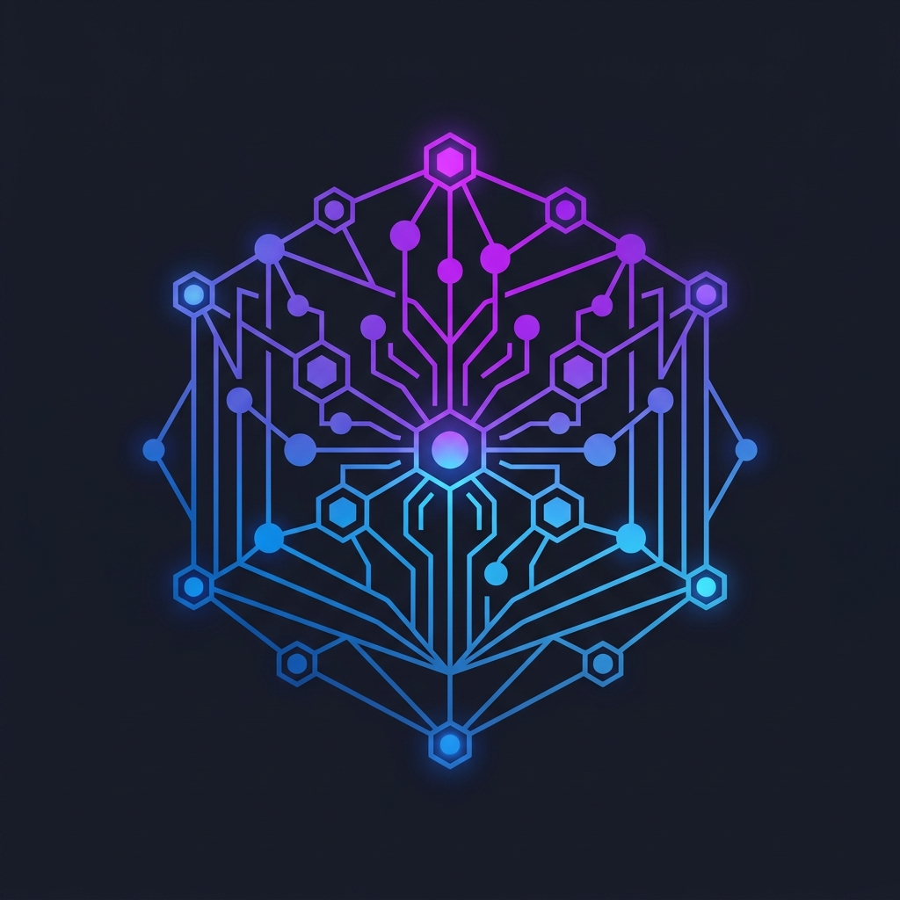

<div align="center">
  
  <h1>📚 Corpus</h1>

  <p>
    <em>A corpus is a large, structured collection of written or spoken texts stored on a computer and used for linguistic research, or a complete body of written work by a single author.</em>
  </p>

  <p>
    <strong>Create a Corpus for your entire codebase.</strong>
  </p>

  <p>
    <a href="https://modelcontextprotocol.io">
      
    </a>
    <a href="https://nodejs.org">
      
    </a>
    <a href="https://github.com">
      
    </a>
  </p>
</div>

---

**Corpus** aggregates the documentation across all your organization's repositories, builds a live system map using Spotify Backstage catalog entities, and puts it all behind a powerful **Model Context Protocol (MCP)** server.

It supports **GitHub** and **GitLab** out of the box, with an extensible adapter architecture to support any VCS provider.

Give your AI agents (Claude, Copilot, etc.) the holistic context they need to understand your architecture, service ownership, docs, and code—all in one place!

## ✨ Features

- 🗺️ **Auto-Generated Entity Graph**: Fully parses Backstage `catalog-info.yaml` entities (Components, APIs, Systems, Users) and generates a bidirectional relationship graph using well-known relations (e.g., `ownerOf`/`ownedBy`, `providesApi`/`apiProvidedBy`).
- 📖 **Centralized Doc Search**: Fast lexical search across `README.md`, `docs/**/*.md`, `adr/**/*.md`, and AI skills across your entire org.
- 🔍 **Global Code Search**: Keyword search across all organization repositories via the GitHub Code Search API.
- 💬 **Issue & PR Context**: Proxies to GitHub's search API to find discussions, PRs, and issues across the org (`search_issues_and_prs`).
- 📄 **File Reading**: Direct access to precise file contents from any repository branch or commit.
- ⚙️ **API Schema Aggregation**: Automatically indexes `openapi` and `swagger` files so agents can pull down endpoint contracts instantly (`list_api_schemas`).
- 🚀 **Zero-Config Start**: Auto-runs missing builds on startup. If you have credentials, just hit `npm start` and the server fetches and indexes everything.
- 🐞 **Gap Reporting**: Optional ability to file a GitHub issue when docs fail to answer an agent's question.

## 🛠️ Quick Start

### 1. Prerequisites

- **Node.js** v22+
- **VCS Authentication**:
  - **GitHub**: Requires a PAT (Classic: `repo`, `read:org` | Fine-Grained: `Contents: Read-only`, `Metadata: Read-only`).
  - **GitLab**: Requires a Personal Access Token with `read_api` and `read_repository` scopes.
  - **Bitbucket**: Requires an App Password with `repository:read` and `workspace:read` scopes.
  - **Azure DevOps**: Requires a Personal Access Token with `Code (Read)` scope.

_(Note: If you enable `ENABLE_GAP_REPORTING`, ensure your token also has Write permissions for Issues / Work Items)._

### 2. Configure Environment

Create a `.env` file in the root directory:

**For GitHub (Default):**

```env
VCS_PROVIDER=github
GIT_ORG=your-github-org-or-username
GIT_PAT=your-github-personal-access-token

# Optional
ENABLE_GAP_REPORTING=false
GITHUB_PROJECT=your-github-org/doc-gaps-repo
```

**For GitLab:**

```env
VCS_PROVIDER=gitlab
GIT_PAT=your-gitlab-personal-access-token
GIT_ORG=your-gitlab-group-name # Optional: Scopes discovery to a specific group
GITLAB_URL=https://gitlab.com # Optional: Change if using self-hosted GitLab

# Optional
ENABLE_GAP_REPORTING=false
GITHUB_PROJECT=your-gitlab-project-id # The Project ID where doc gaps are filed
```

**For Bitbucket:**

```env
VCS_PROVIDER=bitbucket
GIT_ORG=your-workspace-name
GIT_PAT=your-username:your-app-password # Basic Auth or Bearer token

# Optional
ENABLE_GAP_REPORTING=false
GITHUB_PROJECT=your-workspace/your-repo-for-gaps
```

**For Azure DevOps:**

```env
VCS_PROVIDER=azure
GIT_ORG=your-organization-name
GIT_PAT=your-personal-access-token

# Optional
ENABLE_GAP_REPORTING=false
GITHUB_PROJECT=your-project-name # The Azure Project where Doc Gaps (Work Items) are filed
```

### 3. Build & Run

**Local Execution:**

```bash
npm install
npm run build
npm start
```

_Note: `npm start` automatically kicks off the corpus and system-map generation scripts if they haven't been run yet._

**Docker Execution:**

```bash
docker build -t corpus-mcp .
docker run -i -e GIT_ORG=your-github-org -e GIT_PAT=your-github-pat corpus-mcp
```

## 🤖 Registering with AI Clients

### Antigravity

Antigravity natively supports MCP. Configure the server globally by adding it to `~/.gemini/config/mcp_config.json`:

```json
{
  "mcpServers": {
    "corpus": {
      "command": "node",
      "args": ["/absolute/path/to/code-context-mcp/dist/src/index.js"],
      "env": {
        "GIT_ORG": "your-github-org",
        "DOTENV_CONFIG_PATH": "/absolute/path/to/code-context-mcp/.env",
        "CORPUS_DIR": "/absolute/path/to/code-context-mcp/corpus"
      }
    }
  }
}
```

### Claude Desktop

Add this to your `claude_desktop_config.json`:

```json
{
  "mcpServers": {
    "corpus": {
      "command": "node",
      "args": ["/absolute/path/to/code-context-mcp/dist/src/index.js"],
      "env": {
        "GIT_ORG": "your-github-org",
        "GIT_PAT": "your-github-pat",
        "CORPUS_DIR": "/absolute/path/to/code-context-mcp/corpus"
      }
    }
  }
}
```

### Claude Code

Run the following in the project root:

```bash
claude mcp add corpus "node $(pwd)/dist/src/index.js"
```

## 🏗️ Architecture & Commands

- `npm run build:corpus`: Crawls the GitHub org and downloads docs + catalog data into `corpus/manifest.json`.
- `npm run build:map`: Transforms the manifest into an active dependency graph saved to `corpus/system-map.yaml`.
- `npm run build`: Runs the full pipeline and compiles TypeScript.
- `npm run test`: Runs unit tests using the native Node.js test runner.

## 🧩 System Map & `catalog-info.yaml`

Corpus automatically generates a global dependency graph of your organization's services. To participate in the system map, each repository should contain a `catalog-info.yaml` file at its root, conforming to the [Backstage Descriptor Format](https://backstage.io/docs/features/software-catalog/descriptor-format).

Because Corpus acts like a Backstage catalog processor, it extracts any entity type (Component, API, System, Group) and automatically wires up bidirectional relationships. If your `Component` defines `owner: group:auth-team` and `providesApis: [api:auth-api]`, Corpus automatically generates the `ownedBy`/`ownerOf` and `providesApi`/`apiProvidedBy` edges so AI agents can natively traverse your organization's entire service graph.

**Example `catalog-info.yaml`:**

```yaml
apiVersion: backstage.io/v1alpha1
kind: Component
metadata:
  name: my-auth-service
  description: Handles user authentication and token generation
spec:
  type: service
  lifecycle: production
  owner: group:auth-team
  providesApis:
    - api:auth-api
  dependsOn:
    - component:user-database
    - component:email-service
```

## 💡 Best Practices & Philosophy

To get the absolute most out of Corpus and your AI agents, we recommend the following ecosystem practices:

1. **Keep Docs Close to Code**: Documentation should live in the repository next to the code. The best place to document how a system works is directly beside the system itself. Corpus automatically picks up `docs/**/*.md` and `adr/**/*.md` across all your repos.
2. **Central Wiki Repository**: If you have company-wide architectural decisions, RFCs, or code-quality standards that span multiple systems, keep them in a central "Wiki" repository as markdown files. Corpus will aggregate them perfectly.
3. **Synergy with Spotify Backstage**: If you use [Backstage](https://backstage.io/), Corpus is the perfect companion.
   - **Backstage** is an Internal Developer Portal (IDP) built for _humans_, providing a rich web UI.
   - **Corpus** is an IDP built for _AI Agents_, exposing the exact same context over MCP.
     Because Corpus natively parses standard `catalog-info.yaml` files, there is zero duplicated work. If your teams are already defining `dependsOn`, `lifecycle`, and `owner` tags for Backstage, Corpus automatically scoops them up and translates them into an active graph that AI agents can traverse.
4. **Frequent Automated Updates**: The Corpus is meant to be a living, breathing snapshot of your organization. Running the build scripts (`npm run build`) re-fetches and rebuilds the corpus locally. Because it's a simple API scraping script, it consumes **zero LLM tokens** to build. Ideally, Corpus should be deployed centrally within your company, using a cron job (like a GitHub Action) to rebuild the `manifest.json` every night and distribute it to your developers.

## 🤝 Contributing

We welcome contributions! Please see our [Contributing Guidelines](CONTRIBUTING.md) for details on how to get started, set up your development environment, and submit Pull Requests.

This project enforces Conventional Commits. A pre-commit hook automatically formats your code with Prettier and checks it with ESLint.

See the [Setup Skill Guide](.agents/skills/setup/SKILL.md) for more details.

## 📄 License

Corpus is free to use. All intellectual property is owned by **Sayam Hussain**.

This project is licensed under the [MIT License](LICENSE).
